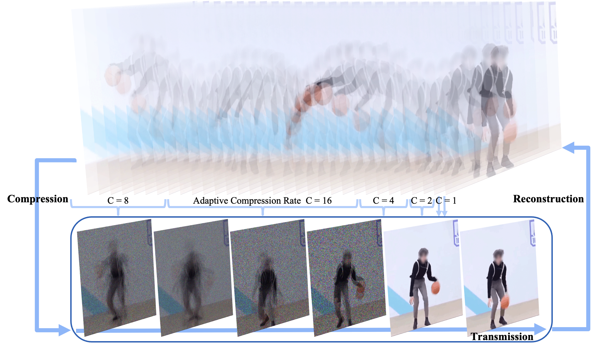

# Adaptive Compressed Sensing for Real-Time Video Compression, Transmission, and Reconstruction (DSAA'2023)

In this repository we provide code of the paper:
> **Adaptive Compressed Sensing for Real-Time Video Compression, Transmission, and Reconstruction**
> 
> Yaping Zhao, Qunsong Zeng, Edmund Y. Lam
> 
> paper link: https://ieeexplore.ieee.org/abstract/document/10302598

<p align="right">
  
</p>

## Dataset
The videos used in our experiments are available at [OneDrive](https://connecthkuhk-my.sharepoint.com/:u:/g/personal/zhaoyp_connect_hku_hk/EUiZDLQQxCFEmPHHeGf-sFIBjMAIfffMQN4KA_fbcQjceg?e=CsQVL8).

Please extract `video.zip` to `video` folder.

## Usage
### Reproduce Paper Results
#### Compression
Simply run:
```angular2html
python main.py
```
Navigate to the `video` folder. You will see files `video*.mp4` as the original videos, and `meas*.mp4` as the compressed videos.
#### Reconstruction
In our paper, we adopt the classical [GAP-TV](https://ieeexplore.ieee.org/document/7532817) algorithm to reconstruct videos. 
For higher reconstruction quality, we recommend [DEQSCI](https://github.com/IndigoPurple/DEQSCI).

###Adjust the Compression Rate
Modify the parameter `cr`, which is the compression rate, in Line 53 of the file `main.py`.

```angular2html
......
### compress video frames into measurements

    output_path = './video/meas%d.mp4' %i
    img_num = len(os.listdir(folder_name))
--> cr = 8 # compression rate
    meas_num = img_num // cr
......
```

## Citation
Cite our paper if you find it interesting!

```
@INPROCEEDINGS{10302598,
  author={Zhao, Yaping and Zeng, Qunsong and Lam, Edmund Y.},
  booktitle={2023 IEEE 10th International Conference on Data Science and Advanced Analytics (DSAA)}, 
  title={Adaptive Compressed Sensing for Real-Time Video Compression, Transmission, and Reconstruction}, 
  year={2023},
  volume={},
  number={},
  pages={1-10},
  doi={10.1109/DSAA60987.2023.10302598}}
```
